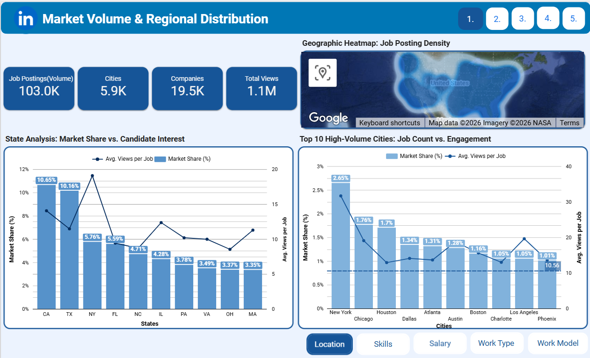
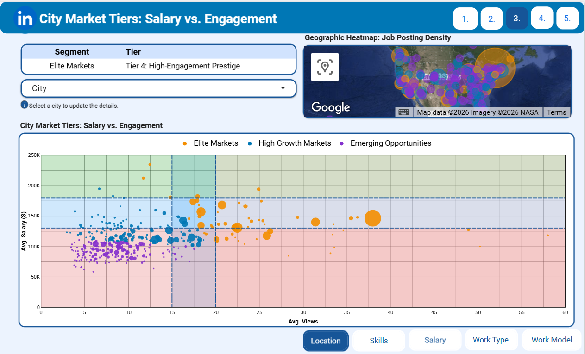

# LinkedIn Job Market Analysis & Segmentation

###  Project Overview
This project analyzes over 103,000 LinkedIn job postings and data from 19,500+ companies to identify market trends, salary distributions, and employment opportunities across the USA. 

The goal was to move beyond simple data reporting and apply Machine Learning techniques to segment the job market strategically.

---

###  Project Ownership & Scope
While this study was conducted as part of a group project, the contents of this repository represent my individual work. 

I was solely responsible for:
* **Data Cleaning & Preprocessing:** Handling complex location data and standardizing salary formats using Python.
* **Market Segmentation Strategy:** Implementing the K-Means Clustering algorithm to group cities into tiers like "Elite Markets" and "Emerging Opportunities."
* **Dashboard Design:** Designing and building the Looker Studio dashboards featured in this repository to visualize the final insights.

*The files uploaded here demonstrate my personal technical execution and findings.*

---

### Key Analysis & Methodologies

#### 1. Market Segmentation (K-Means Clustering)
Instead of looking at cities individually, I applied K-Means Clustering to categorize them based on Average Salary and Candidate Interaction (Views).
* **Elite Markets:** High salary, high competition (e.g., San Francisco, New York).
* **Emerging Opportunities:** High salary potential but lower current competition.

#### 2. Interactive Visualization (Looker Studio)
I created dynamic dashboards to allow stakeholders to filter data by:
* **Job Titles & Sectors** (Engineering, Finance, Healthcare, etc.)
* **Work Models** (Remote, On-site, Hybrid)
* **Geographic Density**

---

### Repository Contents
Since this repository serves as a **portfolio showcase**, it focuses on the analytical outputs and reports rather than the raw codebase.

* **[Project_Report.pdf](Project_Report.pdf)**: The comprehensive analysis report detailing all findings, methodology, and visual results.

### Project Visuals
Below are the key visualizations derived from the analysis:

**1. Dashboard Overview**

**2. Market Segmentation (Elite vs. Emerging Markets)**

**3. Geographic Density Map**

---

### Tools & Technologies
* **Data Analysis:** Python (Pandas, NumPy)
* **Machine Learning:** Scikit-learn (K-Means Clustering)
* **Visualization:** Google Looker Studio
* **Data Source:** LinkedIn Job Postings Dataset

---

* **Connect with me on LinkedIn:** [Elif Çal](https://www.linkedin.com/in/elifcal/)
